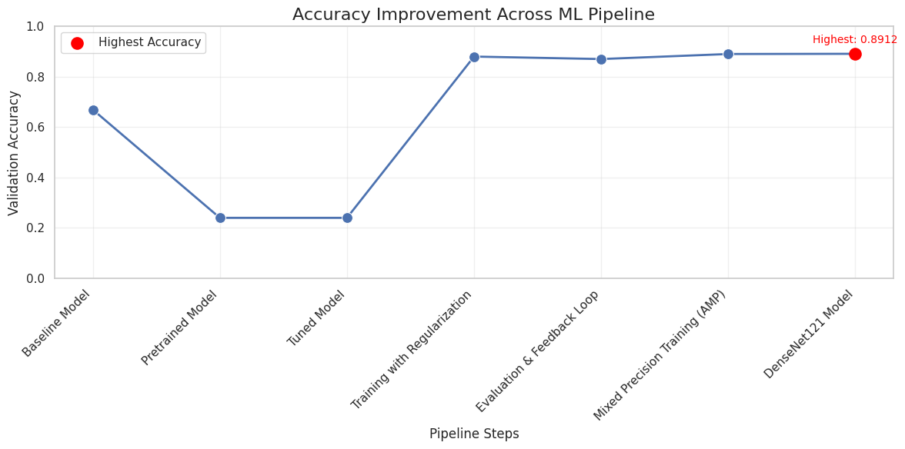

# Skin Cancer Detection with HAM10000 Dataset 🩺🔬

## 📌 Project Overview

This project was developed as part of my **AI course** and submitted as a final project.
Our goal was to build a deep learning model for **skin cancer detection** using the **HAM10000 dataset**.

* The project was initially inspired by [this Kaggle notebook](https://www.kaggle.com/code/akarsh1/skin-cancer-classification-with-85-02-accuracy#Creating-CNN-Model), which achieved **85.02% accuracy** using a CNN-based approach.
* In that work:

  * **Cell 4** used **ResNet18**
  * **Cell 5** used **ResNet34 (pretrained)**

With the help of **my teammate** and **AI-assisted exploration**, we extended the project by experimenting with **additional models and pipelines**.
👉 This improved the accuracy to **\~89%**. 🎉

---

## 📂 Dataset

* **Name:** HAM10000 ("Human Against Machine with 10000 training images")
* **Source:** [Kaggle - HAM10000 Dataset](https://www.kaggle.com/kmader/skin-cancer-mnist-ham10000)
* **Classes:**

  * Actinic keratoses (akiec)
  * Basal cell carcinoma (bcc)
  * Benign keratosis-like lesions (bkl)
  * Dermatofibroma (df)
  * Melanoma (mel)
  * Melanocytic nevi (nv)
  * Vascular lesions (vasc)

---

## 🧠 Models & Pipelines

We compared several architectures to test performance improvements:

* **Baseline CNN** – simple convolutional layers for reference performance
* **ResNet18 / ResNet34 (pretrained)** – used in the initial project
* **DenseNet121** – pretrained with transfer learning (timm)
* **EfficientNet-B0** – lightweight yet high-performing model
* **ResNet50** – classical residual network for deeper representation

### Training Pipelines:

1. **Pipeline 1 – Baseline:** Raw images with basic preprocessing
2. **Pipeline 2 – Data Augmentation:** Random flips, rotations, and scaling (Albumentations)
3. **Pipeline 3 – Transfer Learning:** Using pretrained ImageNet weights (DenseNet/EfficientNet/ResNet)
4. **Pipeline 4 – Fine-tuning & Optimization:**

   * Lower learning rate (Adam optimizer, lr=1e-4)
   * Regularization with dropout
   * Improved scheduling strategy

---

## ⚙️ Setup & Running the Project

### 🔹 Option 1: Run on **Google Colab** (Recommended 🚀)

1. Open the notebook in Colab:
   [](https://colab.research.google.com/github/findmariammariaa/skin-cancer-detection-ham10000/blob/main/HAM10000_Improved_Accuracy.ipynb)

2. In Colab, enable GPU:

   * Go to **Runtime → Change runtime type → Hardware accelerator → GPU**

3. Run all cells to train and evaluate models.

### 🔹 Option 2: Run Locally

Clone the repository:

```bash
git clone https://github.com/your-username/skin-cancer-detection-ham10000.git
cd skin-cancer-detection-ham10000
```

Install dependencies:

```bash
pip install -r requirements.txt
```

Launch Jupyter:

```bash
jupyter notebook
```

## 📊 Results

### ✅ Accuracy Improvement Across Pipelines

The following chart shows how validation accuracy improved as we applied different pipelines:

<p align="center">  
    
</p>  

**Figure:** Accuracy improvement across training pipelines — from a **Baseline Model** to **DenseNet121**, with the highest validation accuracy reaching **0.8912 (\~89%)**.

Pipeline steps included:

* Baseline Model
* Pretrained Model
* Tuned Model
* Training with Regularization
* Evaluation & Feedback Loop
* Mixed Precision Training (AMP)
* DenseNet121 Model
---

## 🛠️ Future Work

* Ensemble of multiple models for higher accuracy
* Deploy the classifier as a **Streamlit/Flask web app**
* Use **Grad-CAM** for explainability of model predictions

---


---

## 🙌 Acknowledgements

* Course instructors and teammates for feedback and guidance
* Initial inspiration: [Kaggle notebook by Akarsh](https://www.kaggle.com/code/akarsh1/skin-cancer-classification-with-85-02-accuracy#Creating-CNN-Model)
* Dataset: HAM10000 from [Kaggle](https://www.kaggle.com/kmader/skin-cancer-mnist-ham10000)
* Pretrained models: [timm library](https://github.com/rwightman/pytorch-image-models)
* Data augmentations: [Albumentations](https://albumentations.ai/)
* Colab GPU support for training large models

## 👥 Contributors
- MD Yousuf
